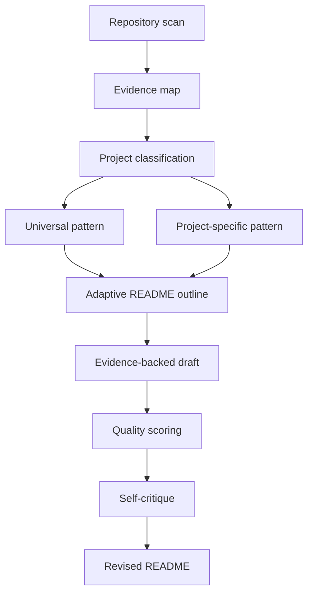
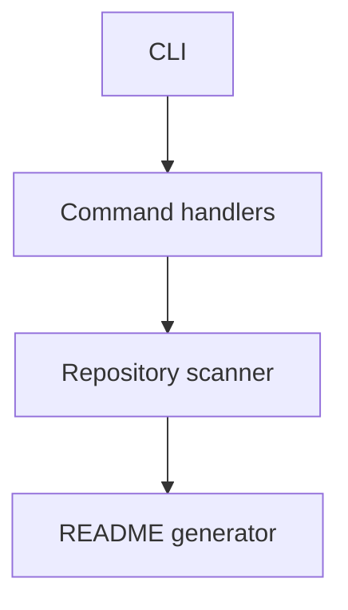

# README Architect

A repository-aware agent skill that generates beautiful, accurate, product-minded README files using best-practice patterns from top open-source projects.

README Architect is not a static template and not a prompt pack. It inspects a repository, classifies the project type, loads reusable README patterns, drafts from evidence, scores the result, self-critiques, and revises before delivery.

> README Architect does not copy templates. It learns patterns, detects project context, and composes the most useful README for that repository.

## What it does

README Architect helps AI agents create public-quality `README.md` files for real software repositories.

It can:

- analyze repository metadata, source structure, scripts, CI/CD, deployment config, screenshots, docs, APIs, commands, and tests
- classify project type from evidence
- select adaptive README patterns instead of using one fixed structure
- extract repository-backed features
- generate architecture explanations and Mermaid diagrams
- produce installation, configuration, usage, development, roadmap, contributing, support, and license sections
- include screenshots, demo sections, command tables, API examples, feature tables, and project structure trees when supported by evidence
- score README quality with pattern fit, evidence grounding, visual readability, developer onboarding, and product story
- mark missing information as TODO instead of hallucinating

## Why it exists

Most generated READMEs fail in predictable ways:

- they invent setup commands that do not work
- they describe features that are not in the codebase
- they use the same structure for every project
- they bury the value proposition under generic claims
- they skip screenshots, architecture, contributor context, and operational details
- they sound like an AI wrote them

README Architect follows one principle:

> Understand first. Document second.

If the repository does not prove something, the README must not claim it. Missing information is surfaced as precise TODOs instead of fake confidence.

## How it works



Workflow:

1. Inspect repository evidence.
2. Classify project type.
3. Load `patterns/universal.yml`.
4. Load the most relevant project-specific pattern.
5. Compose a README structure for the repository.
6. Generate content from repository evidence.
7. Mark missing information as TODO.
8. Score the README.
9. Improve before final output.

## Supported project types

| Project type | README emphasis |
| --- | --- |
| Mobile app | screenshots, platform support, simulator/device install, permissions, release/distribution |
| Web app | demo, screenshots, features, local dev, deployment, architecture |
| SaaS | product story, auth/billing/database evidence, integrations, deployment, security/privacy notes |
| CLI | install command, one-line usage, commands, flags, examples, configuration |
| Library | package install, minimal code example, API overview, compatibility, advanced usage |
| Chrome extension | screenshots, load-unpacked setup, permissions, background/content scripts, privacy |
| Desktop app | screenshots, platform support, install/run, packaging, distribution |
| API platform | quick request, auth, endpoints/schema, architecture, local server, deployment |
| Open-data project | data sources, pipeline, schema, update frequency, reproducibility, attribution |

## Pattern library

The pattern library lives in `patterns/`:

```text
patterns/
├── README.md
├── universal.yml
├── mobile-app.yml
├── web-app.yml
├── saas.yml
├── cli.yml
├── library.yml
├── chrome-extension.yml
├── desktop-app.yml
├── api-platform.yml
└── open-data-project.yml
```

Each project-specific pattern defines:

```yaml
project_type:
description:
priority_sections:
recommended_sections:
avoid:
visuals:
required_evidence:
readme_strategy:
```

The patterns are inspired by proven README conventions from high-quality open-source projects and resources such as Best README Template, Awesome README, and README Best Practices. They are references for reusable documentation principles only; README Architect does not copy external templates verbatim.

## Install

Copy or symlink the skill into an agent skill directory:

```bash
cp -R skills/readme-architect ~/.hermes/skills/readme-architect
```

For other agent systems, install the `skills/readme-architect` directory wherever that system loads reusable skills. Keep the root `patterns/` directory available to the agent, because the skill references it during pattern selection.

## Usage

Ask your agent to use the skill against a repository:

```text
Use README Architect to analyze this repository and generate a new README.md.
Do not overwrite the existing README until you show me the scored draft.
```

Recommended write-mode request:

```text
Use README Architect to replace README.md. Preserve accuracy over completeness.
Classify the project type, use the pattern library, and include the final score.
```

## Example output shape

~~~markdown
# Project Name

One concrete sentence explaining what the project does and who it helps.


## Why this exists

A short, repository-grounded explanation of the problem and why this project matters.

## Features

| Feature | Evidence |
| --- | --- |
| CLI export command | `src/commands/export.ts` |
| Config file support | `src/config/load.ts`, `docs/config.md` |

## Quick start

```bash
pnpm install
pnpm dev
```

## Architecture



## README quality score

```yaml
overall_score: 9.2
criteria:
  pattern_fit:
    score: 9
  evidence_grounding:
    score: 10
  visual_readability:
    score: 9
  developer_onboarding:
    score: 9
  product_story:
    score: 9
```
~~~

## Repository layout

```text
.
├── README.md
├── LICENSE
├── patterns/
│   ├── README.md
│   ├── universal.yml
│   ├── mobile-app.yml
│   ├── web-app.yml
│   ├── saas.yml
│   ├── cli.yml
│   ├── library.yml
│   ├── chrome-extension.yml
│   ├── desktop-app.yml
│   ├── api-platform.yml
│   └── open-data-project.yml
├── skills/
│   └── readme-architect/
│       ├── SKILL.md
│       ├── templates/
│       ├── examples/
│       └── docs/
└── tests/
```

## Quality scoring

README Architect scores every generated README. A README is considered successful only when the final score is at least `9.0`.

Criteria:

- `pattern_fit` — does the README structure match the repository type?
- `evidence_grounding` — are claims backed by repository evidence?
- `visual_readability` — is the README scannable and visually strong?
- `developer_onboarding` — can a developer install, run, and contribute?
- `product_story` — does the README clearly explain why the project matters?
- `technical_accuracy` — are commands, architecture, integrations, and setup details correct?

## Roadmap

- [x] Evidence-first README generation skill
- [x] Specialized templates for mobile apps, SaaS products, libraries, and CLIs
- [x] Best-practice pattern library
- [x] Project type classifier documentation
- [x] Pattern-fit and evidence-grounding scoring
- [ ] Optional executable scanner for producing evidence maps automatically
- [ ] Golden README fixtures for each project type
- [ ] Integration tests against sample repositories

## Contributing

Contributions are welcome. Useful contributions include:

- new project-specific patterns
- better classifier signals
- stronger scoring rubrics
- example READMEs generated from real repositories
- validation tests
- documentation improvements

To validate the current repository shape:

```bash
python3 tests/validate_structure.py
```

## License

MIT. See `LICENSE`.
