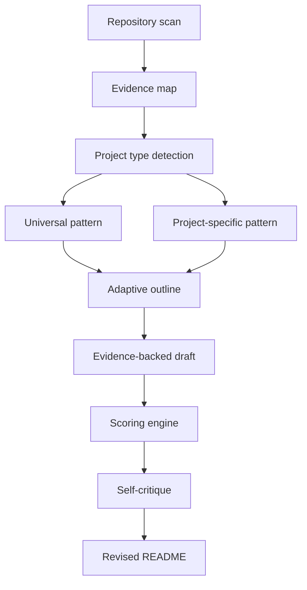

# Repository Understanding Architecture

README Architect uses a staged analysis pipeline.

## Stage 1: Repository scan

Collect facts from manifests, source directories, docs, CI/CD, deployment files, tests, and assets. The scan should prefer direct file reads over assumptions.

## Stage 2: Evidence map

Normalize findings into a structured map:

- project identity
- stack
- commands
- features
- architecture
- screenshots
- missing information

This map is the source of truth for the README.

## Stage 3: Project type detection

Select one dominant type:

- mobile app
- SaaS/web product
- library
- CLI
- default

Use evidence, not preference. A package with a CLI entry point and importable API may use the CLI template with a library section, or the library template with a CLI section, depending on what users primarily consume.

## Stage 4: Pattern selection

Load `patterns/universal.yml` and the most relevant project-specific pattern. README Architect does not copy templates. It learns patterns, detects project context, and composes the most useful README for that repository. If evidence is missing, insert targeted TODOs.

## Stage 5: Adaptive outline composition

Compose section order from the selected pattern and repository audience. Mobile apps should foreground screenshots and device setup; CLIs should foreground install and commands; libraries should foreground package install and code examples; open-data projects should foreground sources, schema, freshness, and reproducibility.

## Stage 6: Drafting

Generate a README that is concise, specific, and visually structured. Use badges, diagrams, tables, and galleries only when they improve clarity.

## Stage 7: Scoring

Score value proposition, technical accuracy, setup clarity, visual presentation, open-source readiness, and architecture explanation.

## Stage 8: Self-critique and revision

Run the hallucination and onboarding checks. Revise weak sections before final delivery.

## Suggested agent implementation notes

- Use file search to identify candidate evidence quickly.
- Read manifests and config files before source code.
- Read representative source files for each feature claim.
- Prefer line-specific evidence when available.
- Run safe commands such as tests or package script listing when useful.
- Avoid destructive writes until the user approves.
