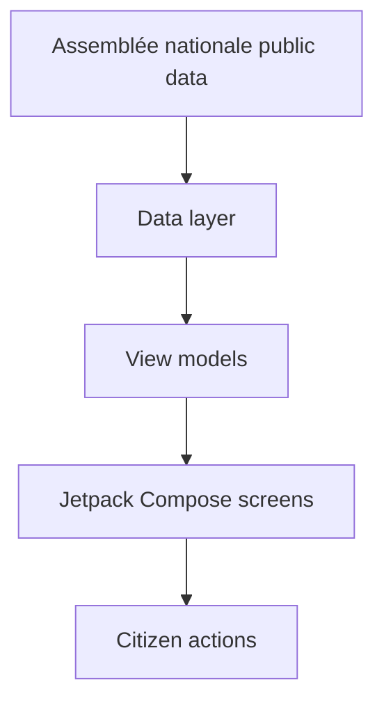

# CitizenEye

CitizenEye helps French citizens understand how elected representatives vote, follow upcoming legislation, and act before decisions become law.


## Screenshots

| Activity feed | Vote details |
| --- | --- |
|  |  |

## Why this exists

Parliamentary data is public, but it is rarely easy to scan. CitizenEye turns representative activity, vote details, and legislative signals into short, actionable screens designed for citizens who want facts before opinions.

## Features

- Representative activity feed — backed by `ActivityFeedScreen.kt`.
- Vote detail cards — backed by `VoteDetailScreen.kt`.
- Public-data-first civic workflow — backed by the repository's Assemblée nationale data integration.

## Architecture

CitizenEye is an Android application built with Kotlin and Jetpack Compose. Screens are organized around civic actions: scan representative activity, inspect a vote, and decide whether to follow or act.



## Getting started

### Prerequisites

- Android Studio
- JDK compatible with the Gradle configuration
- Android SDK

### Build

```bash
./gradlew assembleDebug
```

### Test

```bash
./gradlew test
```

## Project structure

```text
app/
  src/main/java/        Android source code
  src/main/res/         Android resources
 docs/screenshots/      Product screenshots
```

## Roadmap

TODO: Add maintainer-approved roadmap.

## Contributing

Contributions are welcome. Fork the repository, create a feature branch, run the Gradle checks, and open a pull request with a clear description.

TODO: Add coding standards and review expectations.

## License

TODO: Add license.

---

## README quality score

```yaml
overall_score: 8.7
criteria:
  value_proposition: 9
  technical_accuracy: 9
  setup_clarity: 8
  visual_presentation: 9
  open_source_readiness: 8
  architecture_explanation: 9
strengths:
  - Concrete value proposition tied to civic data workflows.
  - Screenshots and architecture diagram make the project approachable.
improvements:
  - Missing license.
  - Release/deployment instructions are not documented in the repository.
```
